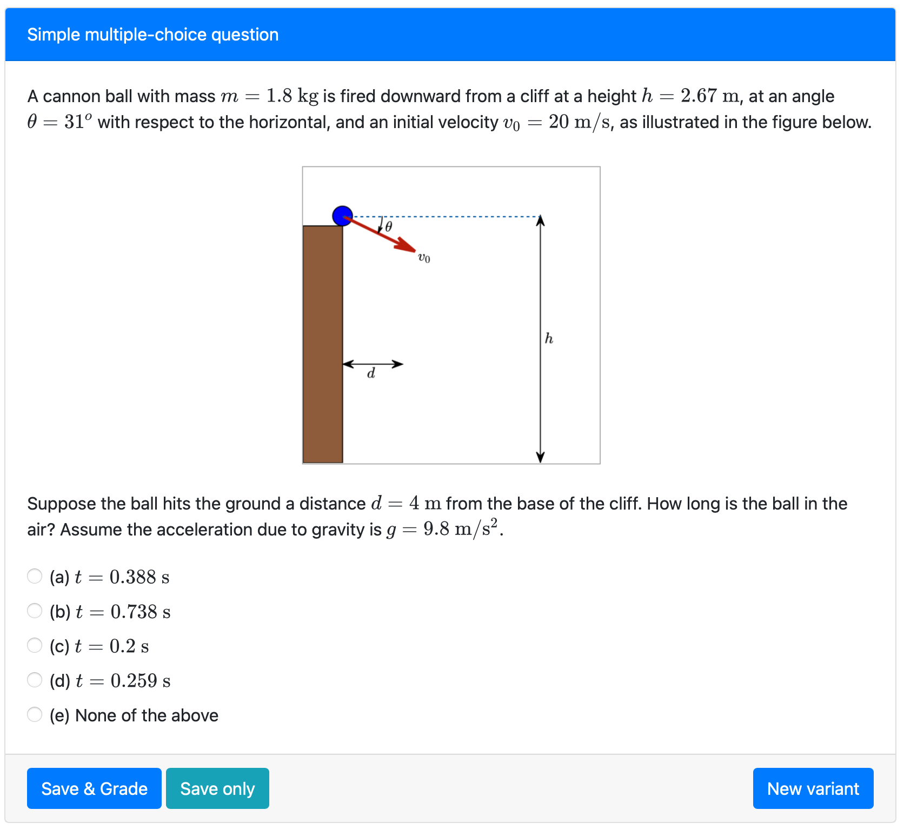
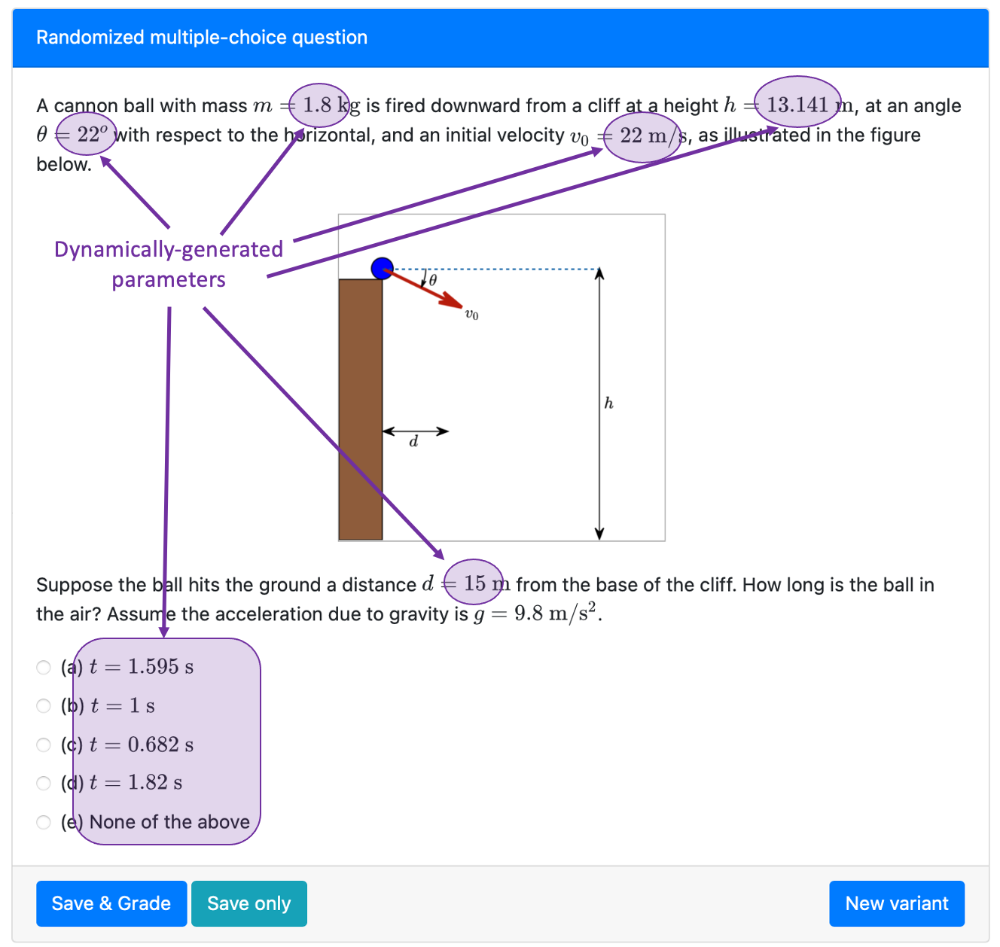
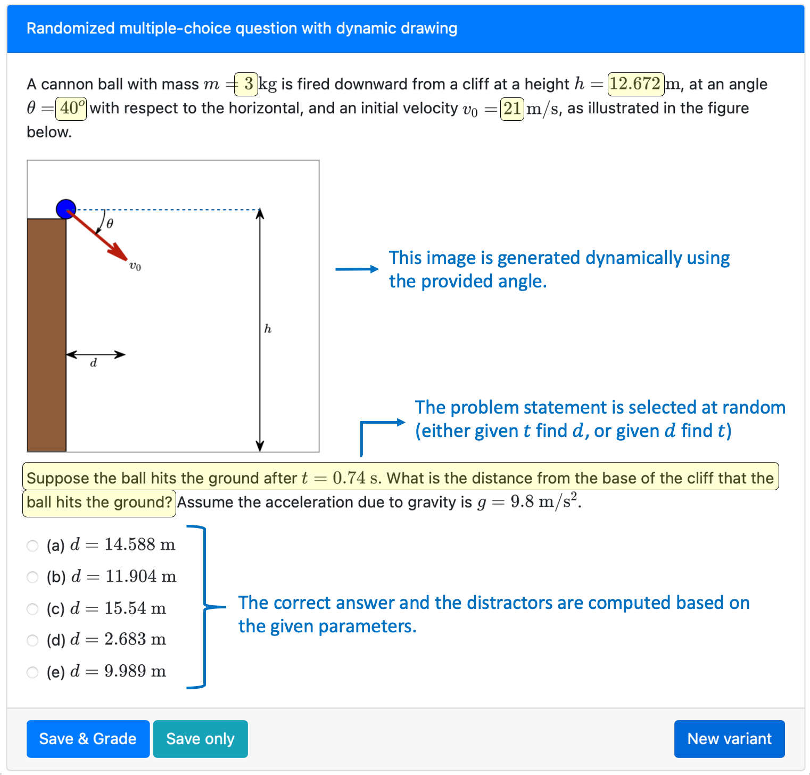

### Simple example

This is a simple example for a multiple-choice question. 



```html src=simple/question.html
contents
```

### Complex example

We can add variation to the above example by randomizing the provided numerical parameters. Here we present the same example question, however, the question parameters are generated in `server.py`.



Here is a more complex example:

```html src=complex/question.html
contents
```

```python src=complex/server.py
contents
```


### More advanced example


Feeling adventurous? Take a look at another variant of the same example, which incorporates even more randomization, and created the image dynamically using `pl-drawing`.



```html src=complex/question.html
contents
```

```python src=complex/server.py
contents
```
