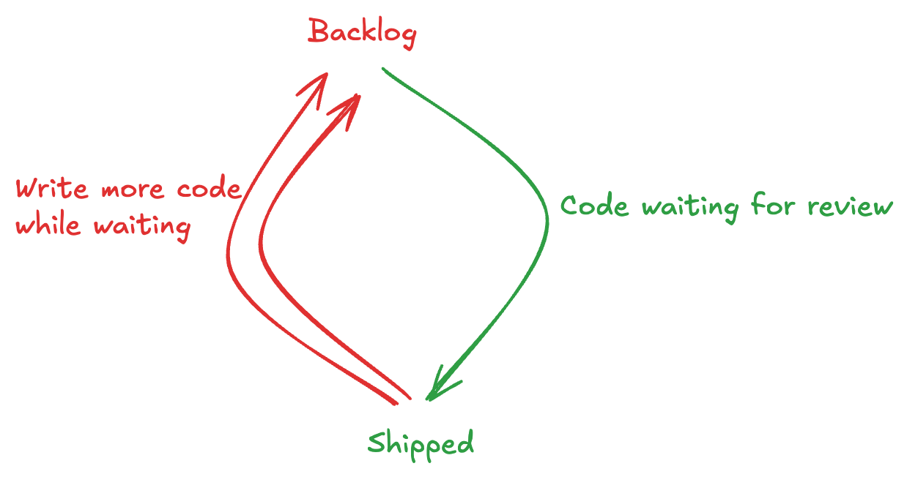

In the past couple months, PrairieLearn has started enforcing a _lot_ more stylistic and logical rules on our code.
As a startup with effectively 3 full-time developers (Nathan, Myles, and I), this has greatly increased our ability to ship code, and unblock some bottlenecks.

We have since been able to ship code with a lot less "nits" (a minor suggestion that doesn't significantly impact the code's functionality),
which has saved us a lot of review cycles (and time!).

# Background

When I started working at PrairieLearn a couple of months ago after graduating from University of Illinois, 
I was in for a rude awakening about my code. While I have had a lot of experience programming since I was a kid, this
was my first experience where I was writing code that a lot of users would see and a lot of developers would read.
From the developer side, I was making basic logic mistakes like rendering the text `null` in HTML, and failing to consider edge cases.
From the user experience side, I was neglecting basic accessibility checks and rendering bugs. In a large company, this is fine -- you have lots of engineers to
do QA, review your code, and pair program. In this startup environment where we want to ship quickly without breakages, this is 

From a code-review perspective, I was generating **way** more code than could be reviewed in a reasonable span of time.

This wasn't an issue before I had joined, as Nathan was able to single-handedly review the sum of all other PRs.

This was obviously causing problems, and we quickly had to switch away from Nathan reviewing all PRs to
 [sharing the review workload](https://docs.github.com/en/organizations/organizing-members-into-teams/managing-code-review-settings-for-your-team).

- unique position to contribute to open-source linters
- helps beginner contributors and LLMs agentsmd
- 
With the release of some well-known
# Welcome to the PrairieLearn Blog

We're thrilled to announce the launch of our new blog! This is where we'll be sharing insights, updates, and stories from the world of online assessment and educational technology.

## What You Can Expect

In the coming months, you'll find:

- **Technical deep-dives** into PrairieLearn features and capabilities
- **Educational insights** from our team of instructors and researchers
- **Success stories** from institutions using PrairieLearn
- **Industry trends** in online assessment and educational technology
- **Behind-the-scenes** looks at how we're building the future of learning

## Our Mission

At PrairieLearn, we believe that technology should enhance, not replace, the human elements of education. Our platform empowers instructors to:

- Create authentic assessments that measure real understanding
- Provide immediate feedback that helps students learn
- Scale personalized learning experiences
- Focus on what matters most: teaching and mentoring students

## Join the Conversation

We're building this blog as a space for dialogue and learning. We want to hear from you:

- What challenges are you facing in online assessment?
- What features would make your teaching more effective?
- How can we better support your educational goals?

## Looking Ahead

This is just the beginning. We have exciting developments in the pipeline, including:

1. **Enhanced question types** for more diverse assessment options
2. **Improved analytics** to help you understand student learning patterns
3. **Better integration** with existing educational tools and platforms
4. **Expanded accessibility** features to ensure PrairieLearn works for everyone

## Get Started

If you're new to PrairieLearn, we encourage you to:

- [Explore our demo course](https://us.prairielearn.com/pl/course_instance/4970)
- [Schedule a consultation](https://calendly.com/marianapl) with our team
- [Join our community](https://join.slack.com/t/prairielearn/shared_invite/zt-13kx0hg6v-uuC3kyt_3iBxjSpyhCbYVw) on Slack

Thank you for being part of the PrairieLearn community. We're excited to share this journey with you!

---

*Have questions or suggestions for future blog posts? We'd love to hear from you at [hello@prairielearn.com](mailto:hello@prairielearn.com).*
